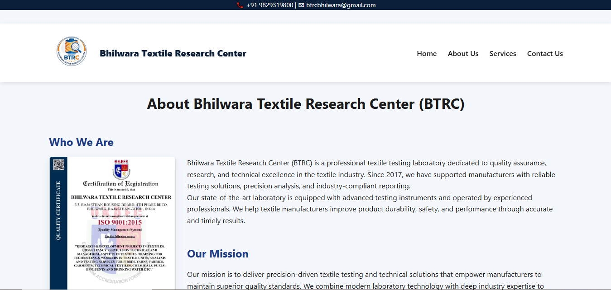

# Bhilwara Textile Research Center (BTRC) Website

Official website developed for **Bhilwara Textile Research Center (BTRC)** to provide information about textile testing services, consultancy solutions, industrial training programs, and contact support.

## Live Website

https://bhilwara-textile-research-center.github.io/

## Website Preview

### Home Page

### About Page

### Services Page

### Contact Page

## Features

* Professional multi-page responsive website
* SEO optimized pages
* WhatsApp floating contact button
* Google reCAPTCHA integration
* Contact form with Formspree
* Embedded Google Maps location
* Smooth UI effects and animations
* Mobile-friendly design

## Pages Included

* Home
* About Us
* Services
* Contact Us

## Technologies Used

* HTML5
* CSS3
* JavaScript
* Formspree
* Google reCAPTCHA
* GitHub Pages

## Developed By

Parth Paliwal

## Organization

Bhilwara Textile Research Center (BTRC)
